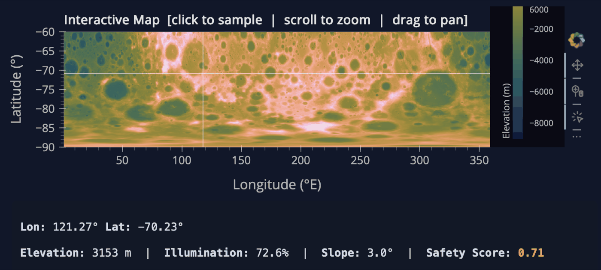
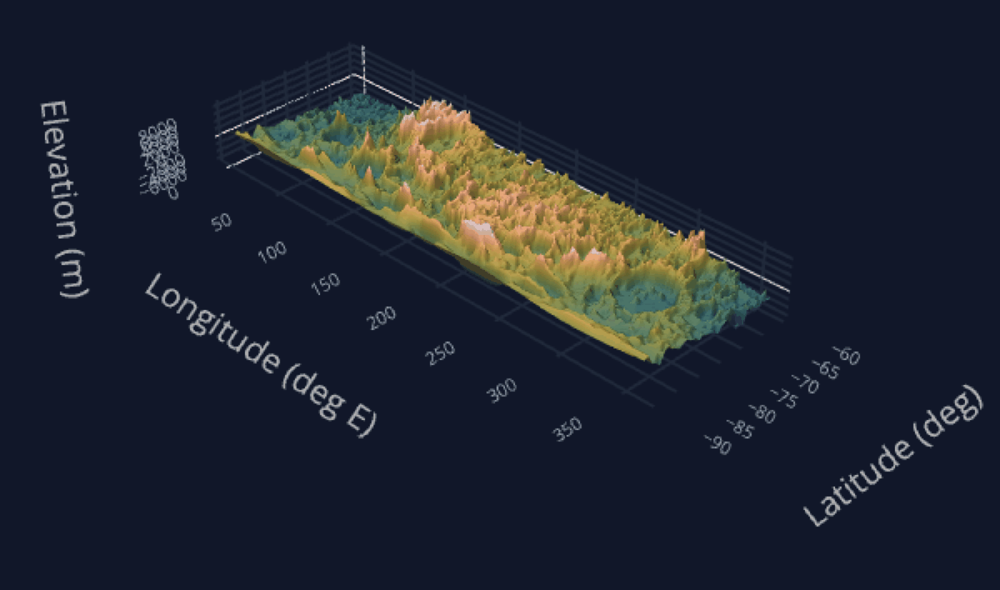
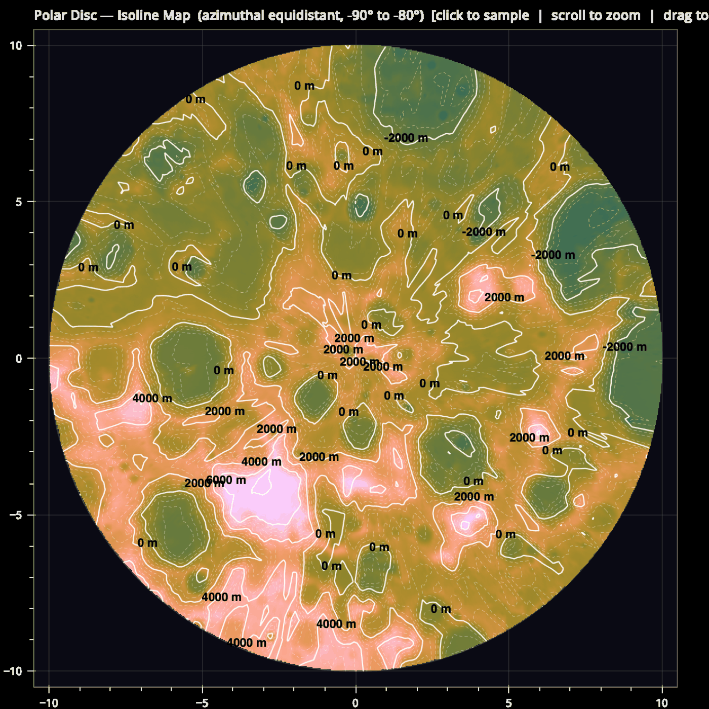
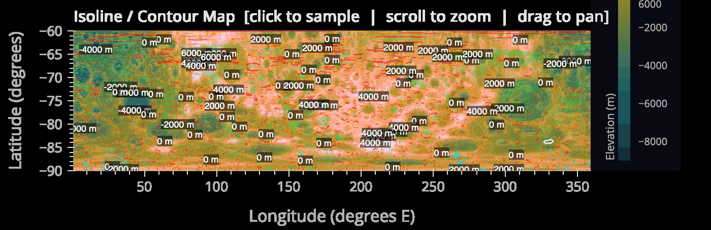
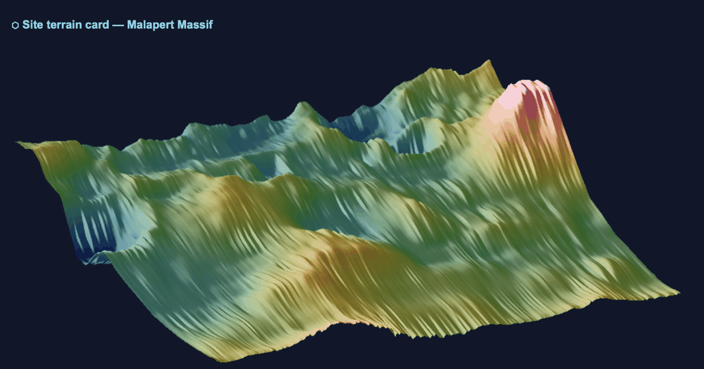
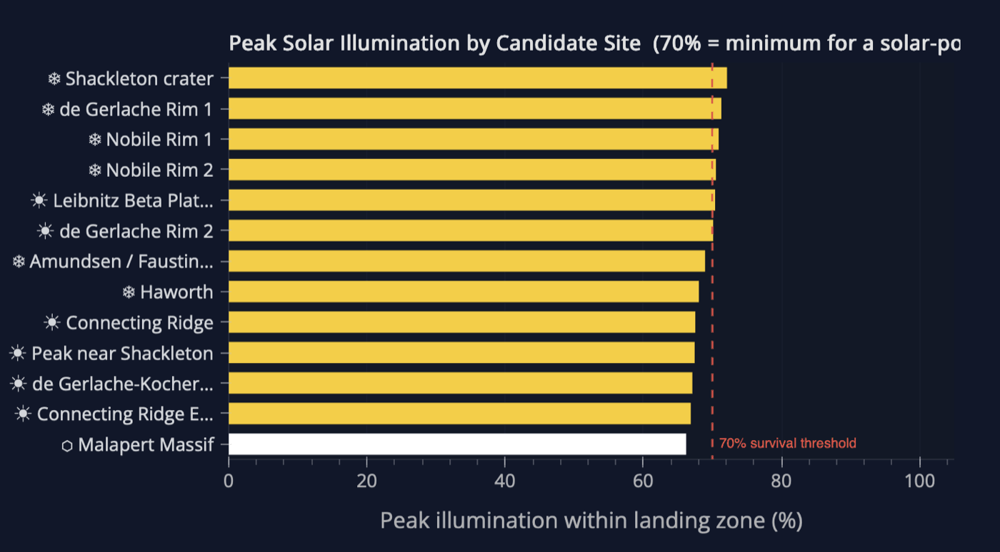
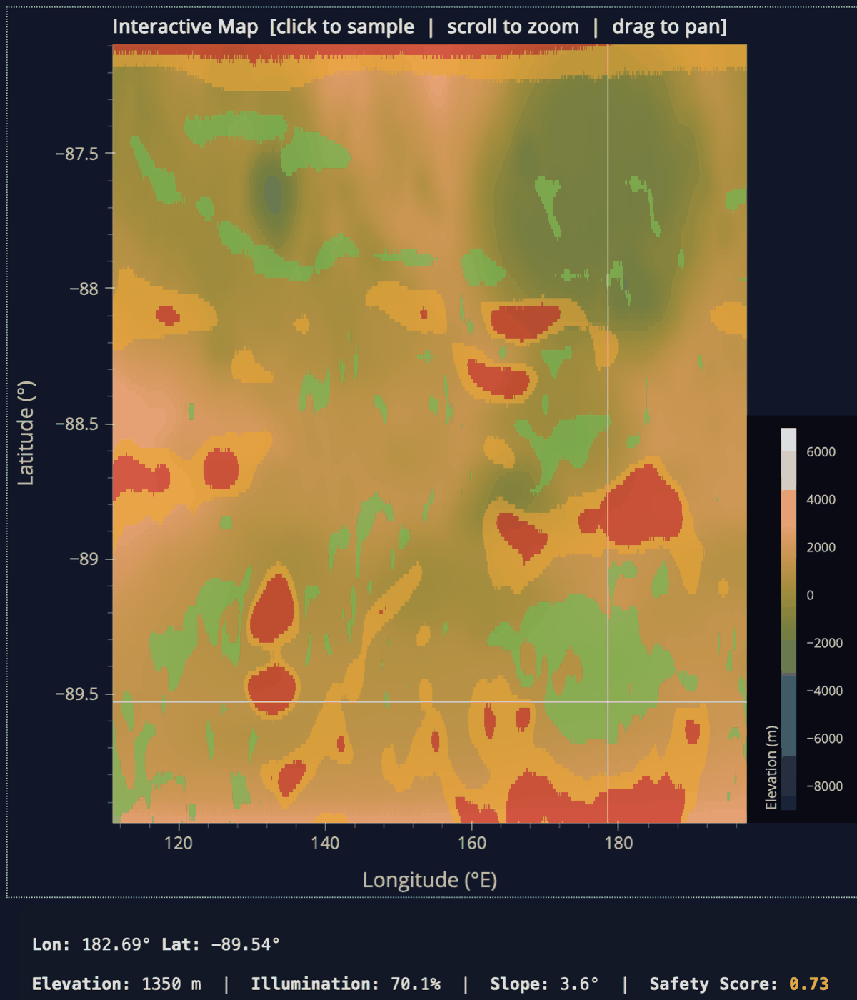

# Artemis III — Lunar South Pole Visualisation

Two interactive web applications for exploring NASA's Artemis III candidate landing region at the
Moon's south pole, built in Python with **PyGMT**, **Panel** and **Bokeh**.

| | |
|---|---|
| **Technical Terrain Explorer** | A mission-planning tool: multi-scale maps, 3D displacement rendering, isoline analysis, and click-to-sample elevation / illumination / slope / safety readouts. |
| **Public Narrative Infographic** | A guided, story-driven dashboard explaining *why* the south pole was chosen, for a non-expert audience. |

The Moon's rotational axis is tilted only ~1.5°, so at the south pole the Sun never rises far above
the horizon. Crater floors there have sat in permanent shadow for billions of years and are cold
enough to trap water ice, while nearby peaks and ridges catch near-continuous sunlight. Those
"Golden Zones" — sunlit high ground within reach of an icy crater floor — are what makes the region
the target for the first crewed lunar landing since Apollo, and what these two tools are built to
find and to explain.

---

## Gallery

**Click-to-sample interactive map** — every click converts pixel coordinates back to
longitude/latitude and reads elevation, illumination, slope and a composite safety score from the
underlying grids.



**3D perspective displacement map** of the full south polar region, rendered by PyGMT `grdview`
with north-west hill-shading at 315°.



**Polar disc isoline map** — an azimuthal equidistant projection centred on −90°, which removes the
~12:1 east–west smearing that equirectangular maps suffer at the pole, so craters keep their true
circularity and contour spacing stays a valid measure of gradient.



**Analytical overlays** — permanently shadowed regions (cyan) and slope hazard masks (amber /
red) alpha-composited over the terrain base layer.



**Per-site terrain cards** — a zoomed 3D render for each candidate landing site (Malapert Massif
shown), used by the guided tour in the narrative infographic.



**Candidate site comparison** — peak illumination within each landing zone, sampled over a window
rather than a single pixel, against the 70% threshold a solar-powered lander needs to survive.



**The selected site** — the peak near Shackleton crater (−89.54°, 182.69°E): 3.6° local slope,
well under the 15° safety threshold, with 70.1% illumination.



---

## What it does

### Technical Terrain Explorer (`src/terrain_explorer.py`, port 5006)

- **Multi-scale exploration** — regional presets and free zoom/pan across the whole polar region
  down to individual crater rims; both the equirectangular map and the polar disc stay linked.
- **Click-to-sample** — instant elevation (m), illumination (%), slope (°) and safety score at any
  point, with a crosshair marker and the option to save a location as a candidate site.
- **Two visualisation techniques, side by side** — PyGMT `grdview` 3D displacement maps vs.
  `grdcontour` isolines, so the strengths of each can be compared directly on the same terrain.
- **Interactive parameters** — contour interval and annotation spacing, PSR luminance threshold,
  vertical exaggeration, threshold elevation, solar contour level, minimum solar exposure, and
  colourmap choice (including perceptually uniform Crameri maps and a colour-blind-safe option).
- **Derived analytical layers** — slope, permanently shadowed region masks, and a weighted safety
  composite (see [Method](#method) below).

### Public Narrative Infographic (`src/narrative_infographic.py`, port 5007)

- **ABT narrative structure** (And–But–Therefore) framing the mission: humanity is returning to the
  Moon *and* the south pole holds unique resources, *but* the terrain is rugged and the 1.5° axial
  tilt casts permanent shadow too cold for robots to survive, *therefore* we must find "Golden
  Zones" where sunlit peaks sit beside icy crater floors.
- **Guided tour** through three representative sites, each with its own 3D terrain card and
  explanatory sidebar, applying progressive disclosure to keep cognitive load low:
  - *Peak near Shackleton* — the icy appearance conveys likely access to water-ice craters.
  - *Malapert Massif* — one of the highest terrains at the pole; the ~7,000 m massif communicates
    the advantage of extreme elevation.
  - *Connecting Ridge* — the "bridge" between craters, carrying the safety message: excellent light,
    but narrow geometry and steep flanking slopes make the ridge itself a landing hazard, while a
    flat, safe zone sits slightly further out.
- **Polar disc view** with rotation, tilt, vertical exaggeration and colour scheme controls.
- **Accessibility-driven palette** — desaturated light blue for ice rather than saturated dark blue
  (pure saturated blue is hard for the eye to focus on, while the lighter tone still reads as
  "cold"), and Cividis as an alternative to red–green ramps, which are illegible to roughly 8% of
  men.

---

## Running it

### 1. System dependency: GMT

PyGMT wraps the GMT C library, which **cannot** be installed by pip:

```bash
brew install gmt          # macOS
sudo apt install gmt      # Ubuntu / Debian
gmt --version             # verify: 6.4 or newer
```

### 2. Python environment

Python **3.11.x** is required (tested on 3.11.1; 3.12+ is untested with PyGMT 0.13.0).

```bash
python3 -m venv venv
source venv/bin/activate          # Windows: venv\Scripts\activate
pip install -r requirements.txt
```

### 3. Getting the data

The DEM and illumination rasters are large and are **not** committed to this repository. They come
from NASA's Scientific Visualization Studio [CGI Moon Kit](https://svs.gsfc.nasa.gov/4720/)
(LOLA digital elevation model + LROC colour/illumination composites). Download and place them so
the tree looks like this — the filenames must match exactly:

```
dataset/
  heightmaps/
    ldem_4.tif                 <- primary heightmap for the narrative infographic (float32, km)
    ldem_16_uint.tif           <- primary heightmap for the terrain explorer (16-bit)
  illumination/
    lroc_color_poles_4k.tif    <- illumination composite (RGB, 4096x2048)
```

Both programs check for their primary files on startup and exit with a clear error if they are
missing.

### 4. Launch

```bash
python3 src/terrain_explorer.py        # -> http://localhost:5006
python3 src/narrative_infographic.py   # -> http://localhost:5007
```

A browser tab opens automatically. The first 3D render takes ~5 s (PyGMT drives GMT's PostScript
pipeline); the narrative infographic's illumination disc builds in a background thread and takes
10–45 s on first load, ~30 s on re-render and ~5 s when switching guided-tour stops.

---

## Method

### Data acquisition and calibration

The base topography is the Lunar Reconnaissance Orbiter (LRO) Lunar Orbiter Laser Altimeter (LOLA)
Digital Elevation Model. The raw file stores elevation as float32 **kilometres**; following the
conventions published by the LROC team, a linear transform maps the data onto the true lunar
elevation range of approximately **−9,000 m to +7,000 m**, so every downstream figure is in metres
and mathematically correct.

**Dataset choice per application.** The terrain explorer prioritises scientific fidelity over
performance and uses `ldem_16_uint.tif` with the 4k illumination composite: the extra bit depth is
critical to suppress vertical quantisation banding in flat landing corridors, which would otherwise
corrupt the slope calculation right at the safety threshold. The narrative infographic trades that
for the lighter float32 DEM, since it prioritises responsiveness over sub-metre fidelity.

**Bicubic reconstruction and C¹ continuity.** Smooth 3D rendering and precise contouring require a
continuous surface *S* reconstructed from the discrete DEM samples. Bilinear interpolation is
efficient but only C⁰ — it creates sharp kinks at cell boundaries, most visible along high-frequency
features like crater rims. The pipeline instead uses order-3 **bicubic** interpolation, giving C¹
continuity (continuous first derivatives), which matters because the slope layer *is* a derivative
and artefacts there would misidentify traversable landing paths. To avoid "overshoot" inventing
terrain features, the implementation is an *interpolation* rather than a *smoothing filter*: the
reconstructed surface passes exactly through the original sample points, `f(pᵢ) = sᵢ`.

### Derived analytical layers

**Slope.** The slope angle θ at a point is derived from the magnitude of the terrain gradient of the
elevation function *f(x, y)*:

```
θ = arctan( sqrt( (∂f/∂x)² + (∂f/∂y)² ) )
```

This layer identifies regions exceeding the safe threshold for landing and rover mobility.

**Safety score composite.** A single normalised metric in [0, 1] aggregates topographic safety,
power availability and mission constraints:

```
S = 0.4·F + 0.4·L + 0.2·E
```

where *F* is local flatness (the inverse of slope), *L* is illumination, and *E* is normalised
elevation. High ground is preferred for persistent solar power, easier communication with Earth and
higher temperature stability. *S* lets planners spot where scientific value intersects with
operational safety.

### Visualisation techniques

**3D perspective rendering and displacement mapping.** 3D renders use PyGMT's `grdview`, following
the principle of displacement mapping: the planar domain *D* is warped along surface normals by the
scalar elevation value.

```
S_displ(x) = x + (n / |n(x)|) · f(x),    ∀ x ∈ S
```

North-west hill-shading at 315° leverages the human visual system to provide effective depth cues.
The gradient is normalised using a double-exponential Laplace distribution to compress the intensity
range, so fine-scale features on steep crater walls stay visible without saturating bright peaks. At
a raster density of 600 DPI, bicubic interpolation across grid nodes yields C¹ continuity —
producing smooth surfaces and first derivatives, eliminating the staircase artefacts of bilinear
(C⁰) or nearest-neighbour methods.

**Isoline analysis and polar disc reconstruction.** An isoline is the set of all points in the
domain sharing a constant scalar value:

```
I(f₀) = { x ∈ D | f(x) = f₀ }
```

Extraction uses the **marching squares** algorithm, processing the grid one quad-cell at a time and
encoding each vertex's state relative to *f₀* into a 4-bit index. That index points into a
jump-table of 16 cases identifying where the contour crosses the cell edges; linear interpolation
then gives the exact intersection point *q* along an edge (pᵢ, pⱼ):

```
q = ( pᵢ(fⱼ − v) + pⱼ(v − fᵢ) ) / (fⱼ − fᵢ)
```

While the interactive map uses an equirectangular layout for panning, the isoline tool renders a
**polar disc** using an azimuthal equidistant projection centred on −90°. This is a genuine
scientific enhancement: standard cylindrical maps suffer a 12:1 east–west stretching artefact at
extreme polar latitudes, whereas the polar frame preserves the true circularity and spatial
proportions of craters, so planners can interpret length and position accurately.

**Comparative analysis — why both are needed.** 3D displacement mapping's strength is intuitive
depth through light and shadow; hill-shading engages pre-attentive perception of topographic
landforms almost instantaneously, which is what lets a geologist judge the structural integrity of a
crater rim or evaluate a descent trajectory against realistic vertical relief. The interactive
Plotly WebGL surface adds camera rotation to overcome occlusion, but at a *precision trade-off*: the
mesh is downsampled to 400 columns to hold interactive frame rates (60 FPS), sacrificing the
sub-metre boulder-scale detail that final landing safety needs.

Isoline maps are superior for *quantitative* planning, because they rely on the most accurate
category of human perception — position and length along a common scale. Unlike 3D views, which
distort distances through perspective, the polar disc gives a 1:1 geographic representation, so
engineers can compute exact surface gradients from the physical distance between contours instead of
estimating slope from shaded pixels. Their limitation is the *information gap* in safe terrain:
landing sites are chosen for flatness, so they often lack enough topographic variation to trigger an
isoline at standard 500 m intervals, leaving "blank zones" that look empty where a 3D render would
still show subtle texture through hill-shading. Both techniques are therefore necessary to plan the
mission.

### Interactive sampling pipeline

Sampling converts discrete screen pixel coordinates back into continuous geographic coordinates. On
a tap event, the pixel coordinates are mapped into the global domain and normalised within the
longitude/latitude ranges to give the grid index:

```
px = (lon − LON_MIN) / (LON_MAX − LON_MIN) · W
py = (LAT_MAX − lat) / (LAT_MAX − LAT_MIN) · H
```

where *W* and *H* are the grid dimensions. This retrieves exact elevation, slope and illumination
values from the underlying arrays for immediate display in the readout pane.

### Dynamic overlays and alpha-compositing

Analytical masks are blended onto the elevation base layer with a linear interpolation model per RGB
channel, so overlapping constraints are visible without obscuring topography:

```
C_out = C_src·α + C_dst·(1 − α)
```

where *C_dst* is the terrain colour and *C_src* the overlay colour.

- **PSR mask** — bright cyan (`#00e5ff`, α = 0.72) highlights regions whose luminance falls below
  the permanent-shadow threshold: high-likelihood locations for large amounts of water ice.
- **Slope danger** — slopes between 10° and 15° take an orange caution mask (α = 0.55); slopes
  beyond the 15° danger threshold take a near-opaque red mask (α = 0.65).

### Other implementation notes

- **Windowed illumination sampling.** At −89.9° latitude a single pixel spans only ~130 m east–west,
  so point sampling frequently lands in a shadow pocket and reports near-zero illumination for sites
  with a known-sunlit rim. The site comparison chart instead max-pools over a 0.05° × 0.05° window —
  the peak illumination achievable within a real landing zone.
- **Threading.** GMT renders run off the Bokeh event loop in worker threads, with matplotlib pinned
  to the `agg` backend so it is safe outside the main thread.
- `src/explore_dataset.py` is the exploratory script used before implementation to inventory the
  rasters and check their value ranges, distributions and correlations.

---

## Candidate landing site selection

**Selected site: the peak near Shackleton crater — latitude −89.54°, longitude 182.69°E.**

This coordinate maximises the strategic trade-offs the region demands. Verified through the terrain
explorer's sampling pipeline, the location has a local slope of **3.6°**, well below the 15° safety
threshold required for lander stability, and sits inside the "green safe zone" of the composite
safety layer. Its illumination is **70.1%** — at the upper end of all candidate sites evaluated,
allowing maximal solar power generation and comfortably clearing the ~70% a solar-powered lander
needs to survive.

Critically, a large crater lies 54.39 km to the north-east, alongside other craters including
Shackleton itself, putting permanently shadowed, ice-bearing terrain within operational reach of a
sunlit, flat, stable landing pad — which is exactly what makes the site optimal for lunar
exploration.

---

## Repository layout

```
src/terrain_explorer.py        Technical terrain explorer (Panel/Bokeh app, port 5006)
src/narrative_infographic.py   Public narrative infographic (Panel/Bokeh app, port 5007)
src/explore_dataset.py         Dataset exploration / sanity-check script
requirements.txt               Pinned Python dependencies
docs/images/                   Screenshots used in this README
docs/references.md             Data sources and background reading
LICENSE                        MIT licence (code only; the NASA data has its own terms)
```

---

## License

Released under the [MIT License](LICENSE). The lunar datasets are not included here and are not
covered by that licence — see [docs/references.md](docs/references.md) for their sources and terms.
